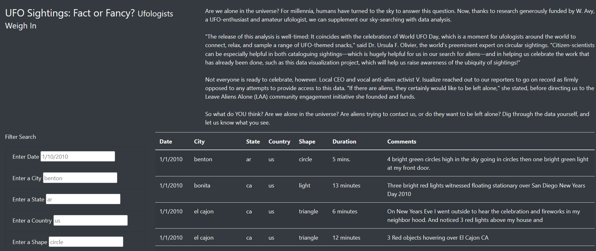
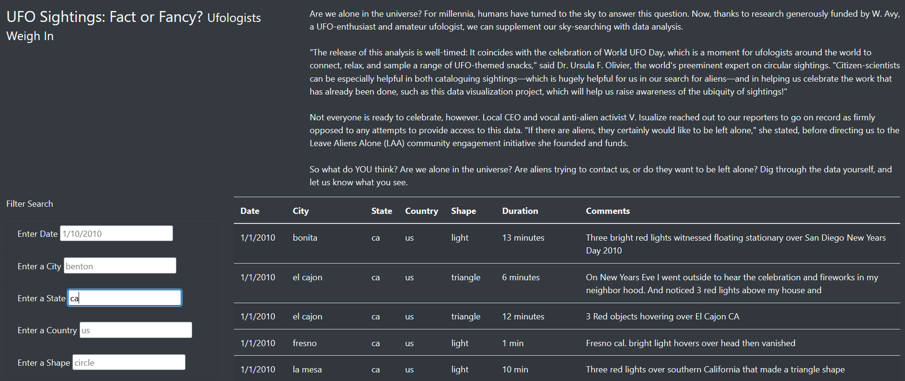

# UFOs
## Overview of Project
The goal of this analysis is to create a webpage with a dynamic table that allows the results of the UFO sightings to be filtered for multiple criteria. Users will be able to filters sightings by city. state, country, and shape. 

## Results

Upon entering the webpage, the user will be able to filter data by inputting a criteria into one or more of the filter fields. The image above shows the filter options on the left side of the web page with no criteria entered. 

Once a field or fields is entered, the webpage will show the results pertaining to the criteria inputted. The image above shows the results for all the sightings in California. However, since more filter options are available, the user will be able to further filter the results if they would like. 

## Summary
A drawback of this webpage is the formatting. Depending on how the user is accessing the page, a computer, tablet, or phone, it might not be favorable or user friendly. 
Two additional recommendations for further development are formatting the page a bit better and having users add more data/details when recording their sightings. 
